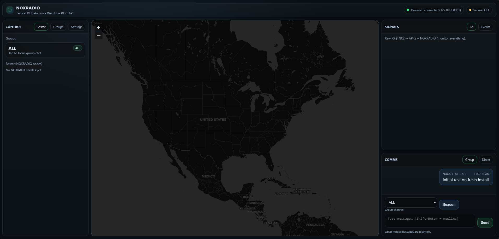

# NoxRadio

**Tactical-style RF data rig on Raspberry Pi (Direwolf/KISS + AX.25) with a Web UI + REST API**

NoxRadio turns a Raspberry Pi (Pi Zero W / Pi W class devices work/Pi3,4,5) plus an **All-In-One Cable (AIOC)** and a handheld radio into a **portable digital data rig** for off-grid messaging and telemetry.

Unlike “normal APRS-only” setups, NoxRadio is designed for **custom payloads and application-level messaging** (group + direct) while still **coexisting with standard APRS/AX.25 traffic**.



## What makes NoxRadio different

- **Application protocol on top of AX.25**: NoxRadio messages are tagged and parsed separately from normal APRS.
- **Tactical Web UI + REST API**: browser UI for monitoring and control, plus endpoints intended for a companion mobile app.
- **Message types beyond APRS**: structured beacon + direct + group messaging flows.
- **Optional Secure Mode**: encrypt/decrypt payloads using a shared key.

> **Important:** NoxRadio is early-stage and focused on building a reliable foundation: bring-up, RF I/O, messaging, storage, and UI workflows.

## Version 1 Features

### RF + Packet Foundation

- Direwolf soundcard TNC build/install (from source)
- KISS TCP interface exposed locally (`127.0.0.1:8001`)
- AX.25 interface bridge (KISS TCP → `ax0`) via `socat` + `kissattach`
- udev rules + service user setup for AIOC-style devices (audio + PTT)

### Web UI + API

- Web UI served on `http://<pi-ip>:8080`
- Live RX display (shows all received frames)
- TX from web UI (send messages into KISS)
- **Roster/contact behavior**: only promotes “contacts” when frames match NoxRadio payload pattern (no conflict with normal APRS)

### Device Settings (Web UI)

- Callsign (app-level identity; optionally sync to Direwolf MYCALL)
- Manual telemetry (lat/lon and additional fields)
- Secure Mode toggle (requires a key to enable)

## Possibilities / Roadmap Ideas

NoxRadio is meant to be extended into a “radio-native data plane” for field operations.

Potential next steps:

- Mobile companion app (Android/iOS) via REST/WebSocket
- Better store-and-forward behavior and delivery acknowledgements
- Message chunking/reassembly for larger payloads
- Presence + timeouts, “last heard”.
- Channel profiles (freq presets, modulation, preamble settings)
- Automatic GPS source support (phone, USB GPS, gpsd)
- Role-based access, multi-user local sessions
- Plugin system for custom message schemas and routing rules

## Hardware Requirements

- Raspberry Pi (Pi Zero W 1.1 supported; faster Pi recommended for heavier UI/features)
- AIOC (All-In-One Cable; e.g., NA6D cable) or equivalent audio/PTT interface
- Handheld radio capable of VOX/PTT and audio interface
- microSD card (16GB+ recommended)
- Optional: USB OTG adapter/hub as needed (Pi Zero)

## Supported Operating Systems

- Raspberry Pi OS (Debian-based)
- Ubuntu for Raspberry Pi (ARM)

> The installer uses **APT-only** for Python dependencies (no pip) to keep installs predictable.

## Installation (Quick Start)

### 1 Clone your repo onto the Pi

```bash
sudo apt-get update -y
sudo apt-get install -y git
git clone https://github.com/justingreerbbi/NoxRadio-Tactical-RF.git noxradio
cd noxradio
chmod +x noxradio-install.sh
sudo ./noxradio-install.sh
```

Enter your callsign when asked (or leave it defualt)

### 2 Open the web UI

Visit `http://<pi-ip>:8080`

## Service Created

NoxRadio install and enables these systemd services so it everything runs on statup.

- `direwolf.service` Runs Direwolf with `/etc/direwolf.conf`.
- `noxradio-ax25-bridge.service` bridges KISS TCP to AX.25 interface `ax0`.
- `noxradio-web.service` Runs the Web UI / API on port `8080`.

## Legal / Compliance Disclaimer

You are solely responsible for how you use this software and any RF transmissions made with it.

By using NoxRadio, you agree that:

- You will comply with all applicable laws, radio regulations, licensing requirements, and frequency/band rules.

- You will not use this project for unauthorized surveillance, harassment, illegal interception, unlawful encryption where prohibited, or any other misuse.

- The authors and contributors provide this software “AS IS”, without warranty of any kind, and assume no liability for damages, claims, legal issues, or regulatory violations arising from use or misuse.

If you do not agree, do not install or use this software.


## What makes NoxRadio different

- **Application protocol on top of AX.25**: NoxRadio messages are tagged and parsed separately from normal APRS.
- **Tactical Web UI + REST API**: browser UI for monitoring and control, plus endpoints intended for a companion mobile app.
- **Message types beyond APRS**: structured beacon + direct + group messaging flows.
- **Optional Secure Mode**: encrypt/decrypt payloads using a shared key.

> **Important:** NoxRadio is early-stage and focused on building a reliable foundation: bring-up, RF I/O, messaging, storage, and UI workflows.

---

## Version 1 Features

### RF + Packet Foundation

- Direwolf soundcard TNC build/install (from source)
- KISS TCP interface exposed locally (`127.0.0.1:8001`)
- AX.25 interface bridge (KISS TCP → `ax0`) via `socat` + `kissattach`
- udev rules + service user setup for AIOC-style devices (audio + PTT)

### Web UI + API

- Web UI served on `http://<pi-ip>:8080`
- Live RX display (shows all received frames)
- TX from web UI (send messages into KISS)
- **Roster/contact behavior**: only promotes “contacts” when frames match NoxRadio payload pattern (no conflict with normal APRS)

### Device Settings (Web UI)

- Callsign (app-level identity; optionally sync to Direwolf MYCALL)
- Manual telemetry (lat/lon and additional fields)
- Secure Mode toggle (requires a key to enable)

## Possibilities / Roadmap Ideas

NoxRadio is meant to be extended into a “radio-native data plane” for field operations.

Potential next steps:

- Mobile companion app (Android/iOS) via REST/WebSocket
- Better store-and-forward behavior and delivery acknowledgements
- Message chunking/reassembly for larger payloads
- Presence + timeouts, “last heard”.
- Channel profiles (freq presets, modulation, preamble settings)
- Automatic GPS source support (phone, USB GPS, gpsd)
- Role-based access, multi-user local sessions
- Plugin system for custom message schemas and routing rules

## Hardware Requirements

- Raspberry Pi (Pi Zero W 1.1 supported; faster Pi recommended for heavier UI/features)
- AIOC (All-In-One Cable; e.g., NA6D cable) or equivalent audio/PTT interface
- Handheld radio capable of VOX/PTT and audio interface
- microSD card (16GB+ recommended)
- Optional: USB OTG adapter/hub as needed (Pi Zero)

## Supported Operating Systems

- Raspberry Pi OS (Debian-based)
- Ubuntu for Raspberry Pi (ARM)

> The installer uses **APT-only** for Python dependencies (no pip) to keep installs predictable.

## Installation (Quick Start)

### 1 Clone your repo onto the Pi

```bash
sudo apt-get update -y
sudo apt-get install -y git
git clone https://github.com/justingreerbbi/NoxRadio-Tactical-RF.git noxradio
cd noxradio
chmod +x noxradio-install.sh
sudo ./noxradio-install.sh
```

Enter your callsign when asked (or leave it defualt)

### 2 Open the web UI

Visit `http://<pi-ip>:8080`

## Service Created

NoxRadio install and enables these systemd services so it everything runs on statup.

- `direwolf.service` Runs Direwolf with `/etc/direwolf.conf`.
- `noxradio-ax25-bridge.service` bridges KISS TCP to AX.25 interface `ax0`.
- `noxradio-web.service` Runs the Web UI / API on port `8080`.

## Legal / Compliance Disclaimer

You are solely responsible for how you use this software and any RF transmissions made with it.

By using NoxRadio, you agree that:

- You will comply with all applicable laws, radio regulations, licensing requirements, and frequency/band rules.

- You will not use this project for unauthorized surveillance, harassment, illegal interception, unlawful encryption where prohibited, or any other misuse.

- The authors and contributors provide this software “AS IS”, without warranty of any kind, and assume no liability for damages, claims, legal issues, or regulatory violations arising from use or misuse.

If you do not agree, do not install or use this software.